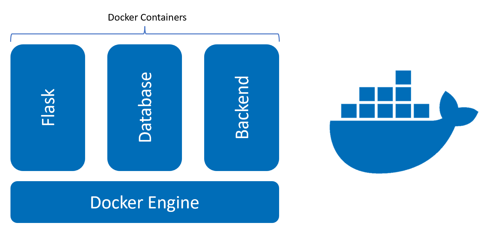
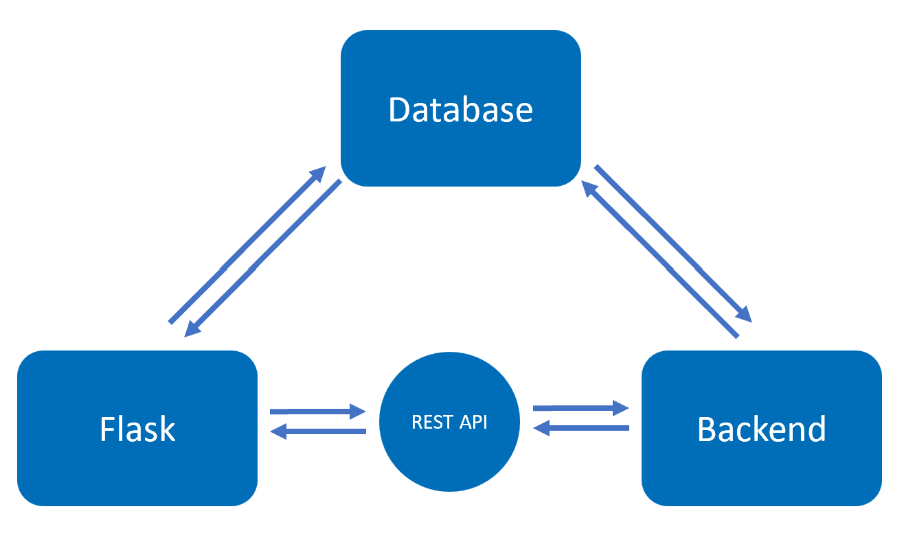
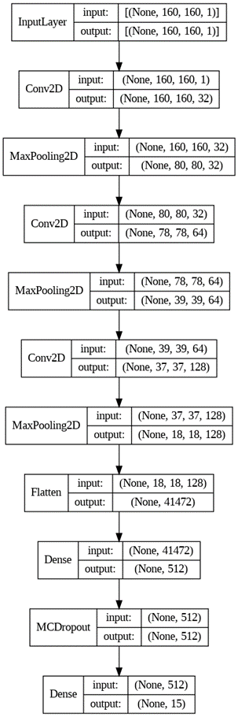
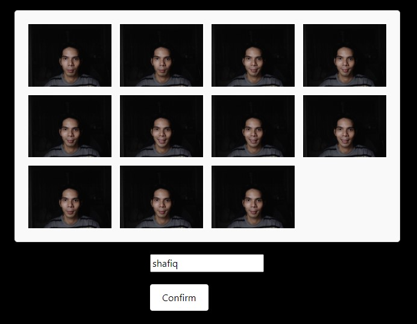
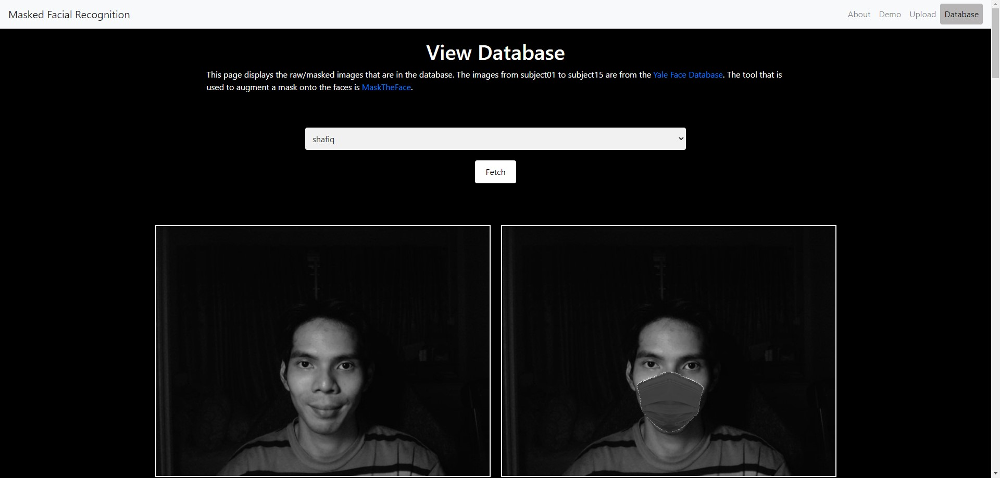
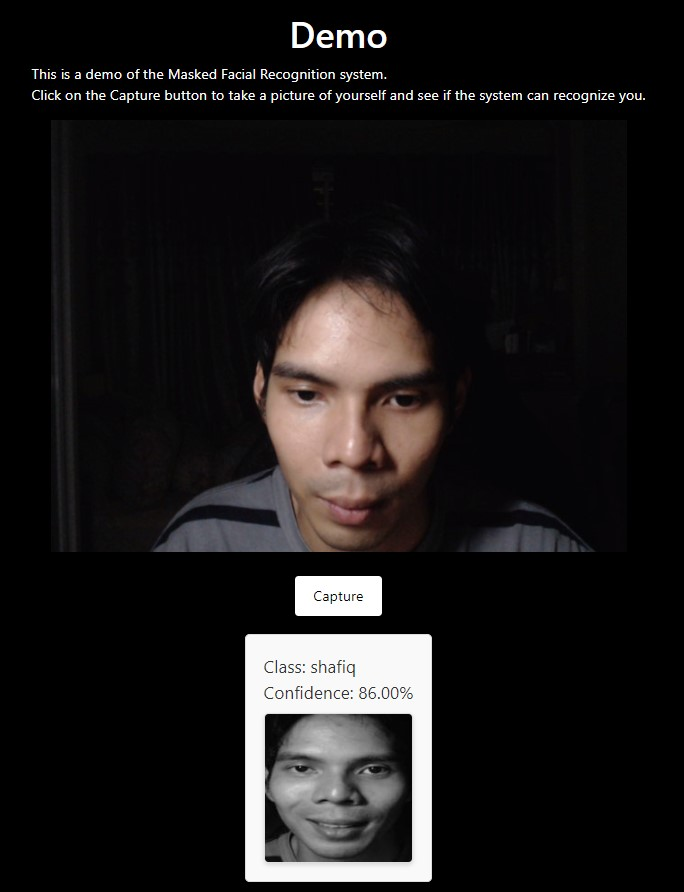
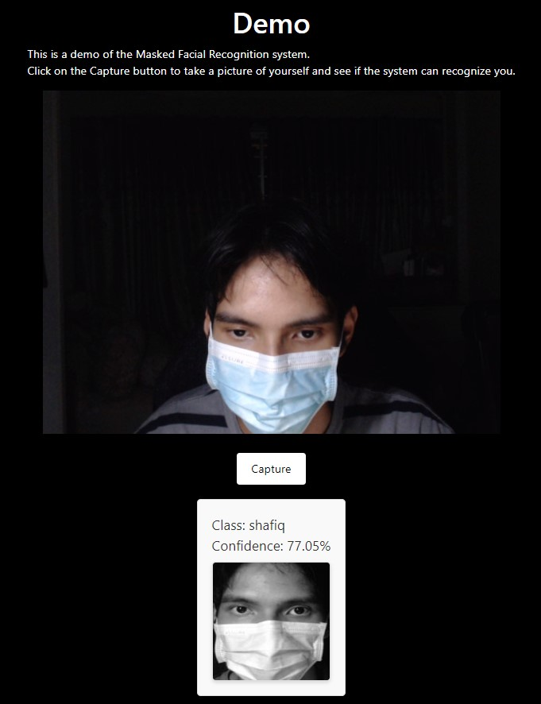

# Facial Recognition w/ Accessories using CNN
## Overview
This repository contains the [docker-compose.yml file](docker-compose.yml) that can be used after pulling the images from my [Docker hub repository](https://hub.docker.com/r/shafiqninaba/fyp). This project requires [Docker Desktop](https://www.docker.com/products/docker-desktop/) to run.

## Instructions
1. Ensure that Docker Desktop is running.
2. Download the [docker-compose.yml file](docker-compose.yml) into an empty directory.
3. Run the command `docker-compose up` in the same directory as the docker-compose.yml file. (this will take approx. 10 mins depending on your network)
4. After the containers are created, the web application can be accessed at http://localhost:5000/
5. Once you are done with the application, `docker-compose stop` to stop the containers or `docker-compose down` to remove the containers

_If any of the ports (5000,8080,3306) are used up, refer to the [Ports](README.md#ports) section below_

### Ports
<table>
  <th>Variable</th><th>Default value</th>
  <tr><td>PYTHONBACKEND_HOST_PORT</td><td>8080</td></tr>
  <tr><td>PYTHONAPP_HOST_PORT</td><td>5000</td></tr>
  <tr><td>MYSQL_HOST_PORT</td><td>3306</td></tr>
</table>

To set your own ports, you can specify them with the docker compose command. For e.g., Windows Powershell: `$env:PYTHONBACKEND_HOST_PORT="8081"; $env:PYTHONAPP_HOST_PORT="5001"; $env:MYSQL_HOST_PORT="3307"; docker-compose up`.

***
## About the project

This project, titled "Face Recognition w/ accessories using CNN", is a Final Year Project by [Shafiq Ninaba](https://www.linkedin.com/in/shafiq-ninaba/), a Year 4 Electrical & Electronic Engineering student at Nanyang Technological University (NTU).

The project uses Convolutional Neural Networks (CNN) for face recognition, with a special focus on recognizing faces with accessories, more particularly surgical masks. The application uses a Convolutional Neural Network (CNN) model trained on a database of faces to recognize individuals in real-time video feeds. The model was implemented using Keras and TensorFlow, and the application was built using Flask for the backend and HTML/CSS/JavaScript for the frontend.

The project is divided into three main components, each encapsulated in a Docker container for ease of deployment and scalability.

  
_Visualisation of this multi-container Docker app_

Containerizing this project with Docker provides consistent environments across development, testing, and production, ensuring the application behaves the same way in all contexts. It isolates each component (image processing/modelling/API backend, MySQL database, web application) in its own environment, reducing conflicts and making updates easier. Docker's modularity facilitates scalability, allowing for more instances of a component to be added in the future as needed. Configuration is simplified with Docker Compose, which defines inter-component interactions in code. Docker was chosen here as its lightweight nature ensures efficient use of system resources, and its widespread support simplifies deployment, particularly in cloud environments.

## Functionality

The Flask container is a web application that allows users to interact with the face recognition system. It provides a user interface for users to upload images for recognition, and displays the results of the recognition. It also provides a view of the database of images used for training the model. The web application interacts with the backend container to perform the recognition task.

The Database container is a MySQL database. It stores information necessary for the face recognition task, such as labeled training data. The images stored are encoded in base64. The database is accessed by the backend container, which contains the CNN model and scripts for data processing, model training, and model evaluation.

The Backend container is responsible for data processing and model training. It uses the Yale Face Database for training data, and the MaskTheFace tool to augment a mask onto the faces. The trained model is then used to recognize faces in the uploaded images. It also provides a RESTful API for the web application to interact with the model.

  
_How the containers communicate with each other_

## Modelling
The model used in this project is a CNN model trained on the [Yale Face Database](http://cvc.cs.yale.edu/cvc/projects/yalefaces/yalefaces.html). The model was trained to recognize faces with and without masks. The model was implemented using Keras and TensorFlow, and was trained on a database of faces augmented with masks using the [MaskTheFace](https://github.com/aqeelanwar/MaskTheFace) tool.

The process starts by reading configuration parameters and connecting to the database container to fetch training, testing, and validation data. The images, stored as base64 strings, are converted to image arrays and saved as temporary files. An ImageDataGenerator is used to augment the images. The model architecture consists of three convolutional layers, a flatten layer, a dense layer with l2 regularization, a dropout layer, and a final softmax layer.

  
_Model Architecture_

The model is trained using the Adam optimizer and categorical crossentropy loss. Early stopping is used to prevent overfitting. The model's performance is evaluated by plotting accuracy and loss over epochs, and by generating a classification report and confusion matrix.

The modelling process is still undergoing experimentation. Other methods to improve the model's performance, such as transfer learning, will also be explored.

***
## Web Application Features
This section demonstrates the features of the web application.

### Upload
Users can upload a new identity into the system. The camera will capture 11 images in a quick succession of 0.5s intervals and check whether there is a face detected in each image. The user can then enter their identity and the images will be uploaded into the database, preprocessed, augmented with a mask and the model will then be retrained with the new identity.

  
_Uploading a new identity to the system_

### Database
Users can view the images of the identities in the database.
  
_View the images of the different identities in the database_

### Demo
Users can test the facial recognition system to see the prediction score.
  
_Output of the facial recognition system on an unoccluded face_

  
_Output of the facial recognition system on a face occluded with a surgical mask_

